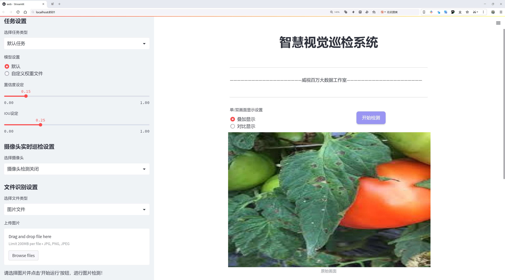
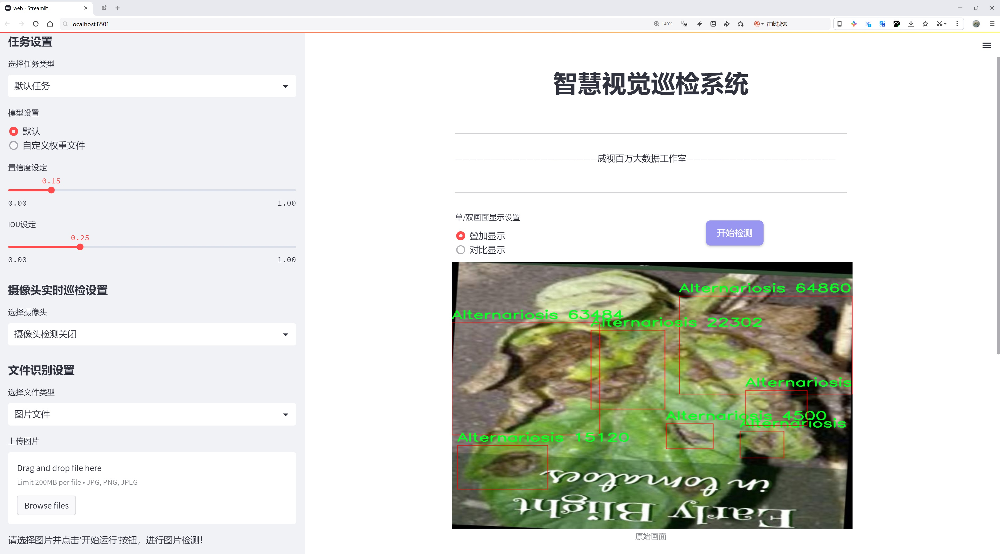
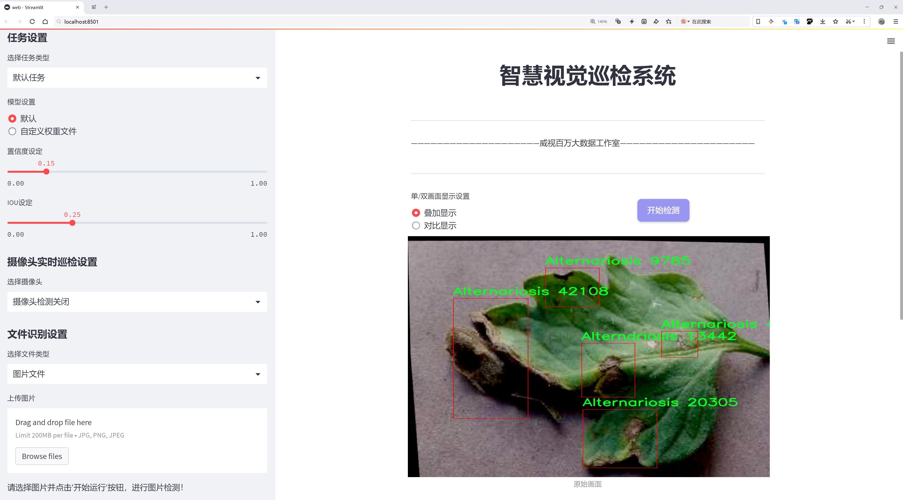
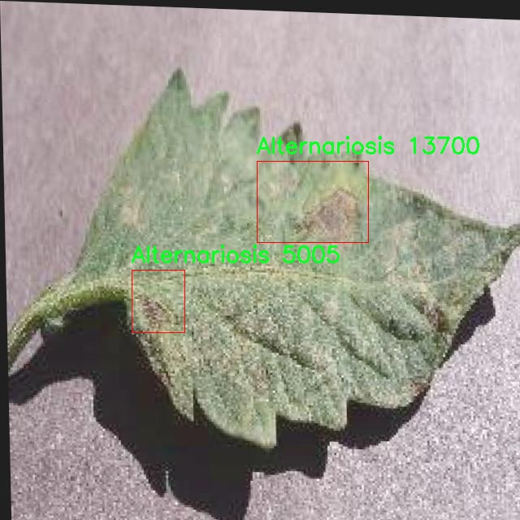
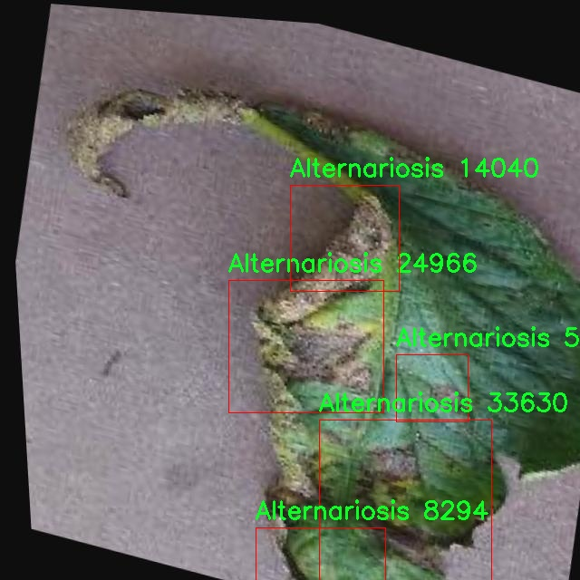
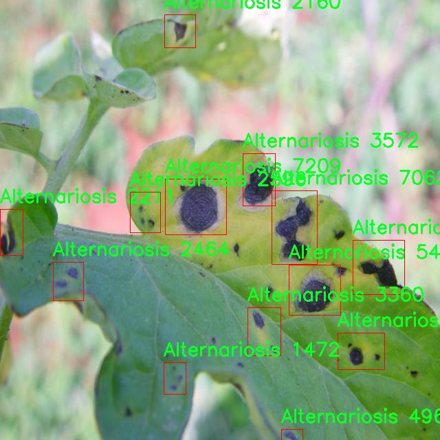
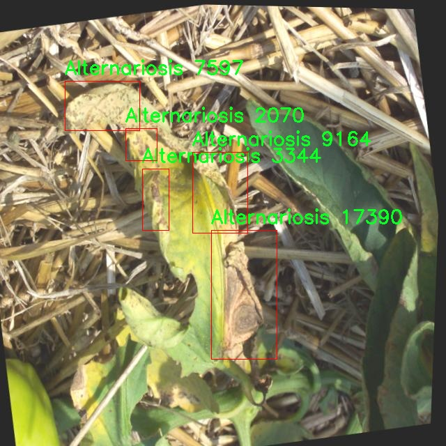
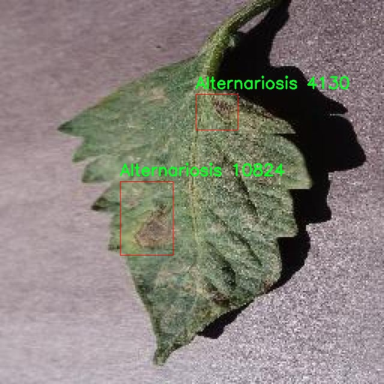

# 番茄病害检测检测系统源码分享
 # [一条龙教学YOLOV8标注好的数据集一键训练_70+全套改进创新点发刊_Web前端展示]

### 1.研究背景与意义

项目参考[AAAI Association for the Advancement of Artificial Intelligence](https://gitee.com/qunmasj/projects)

项目来源[AACV Association for the Advancement of Computer Vision](https://kdocs.cn/l/cszuIiCKVNis)

研究背景与意义

随着全球农业生产的不断发展，植物病害的监测与防治成为了确保作物产量和质量的重要环节。番茄作为全球范围内广泛种植的经济作物，其病害的发生不仅影响了产量，还对农民的经济收入造成了显著影响。Alternariosis（番茄斑点病）是番茄种植中常见且具有破坏性的病害之一，主要由Alternaria属真菌引起。该病害的早期发现和及时处理对于控制病害蔓延、提高番茄的产量和品质至关重要。因此，开发高效的番茄病害检测系统显得尤为重要。

近年来，计算机视觉技术的快速发展为农业病害检测提供了新的解决方案。YOLO（You Only Look Once）系列目标检测算法因其高效性和准确性而受到广泛关注。YOLOv8作为该系列的最新版本，具备了更强的特征提取能力和更快的检测速度，能够在复杂的农业环境中实现实时病害检测。通过对YOLOv8进行改进，结合特定的番茄病害数据集，可以显著提升模型在Alternariosis检测中的表现。

本研究基于Tomate-Alternariosis数据集，数据集中包含1600张标注图像，专注于Alternariosis这一类别。该数据集的构建为模型的训练和评估提供了坚实的基础。通过对数据集的深入分析，可以发现不同生长阶段的番茄植株在遭受Alternariosis侵染后表现出的不同病症特征。这些特征的提取和利用，将为改进YOLOv8模型提供丰富的信息支持。

本研究的意义在于，通过改进YOLOv8算法，构建一个高效的番茄病害检测系统，能够实现对Alternariosis的快速、准确识别。这不仅有助于农民及时发现病害，采取相应的防治措施，降低经济损失，还能为农业生产提供科学依据，推动精准农业的发展。此外，该系统的应用将促进农业信息化建设，提高农业生产的智能化水平，助力可持续农业的发展。

在全球面临气候变化和人口增长的背景下，如何有效提高农业生产效率、减少病害损失已成为亟待解决的问题。基于改进YOLOv8的番茄病害检测系统，能够为这一问题提供切实可行的解决方案，推动农业科技的进步。未来，随着深度学习和计算机视觉技术的不断发展，基于智能算法的病害检测系统将在农业领域发挥越来越重要的作用，为实现农业的高效、绿色、可持续发展贡献力量。

### 2.图片演示







##### 注意：由于此博客编辑较早，上面“2.图片演示”和“3.视频演示”展示的系统图片或者视频可能为老版本，新版本在老版本的基础上升级如下：（实际效果以升级的新版本为准）

  （1）适配了YOLOV8的“目标检测”模型和“实例分割”模型，通过加载相应的权重（.pt）文件即可自适应加载模型。

  （2）支持“图片识别”、“视频识别”、“摄像头实时识别”三种识别模式。

  （3）支持“图片识别”、“视频识别”、“摄像头实时识别”三种识别结果保存导出，解决手动导出（容易卡顿出现爆内存）存在的问题，识别完自动保存结果并导出到tempDir中。

  （4）支持Web前端系统中的标题、背景图等自定义修改，后面提供修改教程。

  另外本项目提供训练的数据集和训练教程,暂不提供权重文件（best.pt）,需要您按照教程进行训练后实现图片演示和Web前端界面演示的效果。

### 3.视频演示

[3.1 视频演示](https://www.bilibili.com/video/BV1R8xLeZEfi/)

### 4.数据集信息展示

##### 4.1 本项目数据集详细数据（类别数＆类别名）

nc: 1
names: ['Alternariosis']


##### 4.2 本项目数据集信息介绍

数据集信息展示

在现代农业中，植物病害的及时检测与处理是确保作物健康和提高产量的关键因素之一。为了实现这一目标，深度学习技术的应用逐渐成为研究的热点。在此背景下，我们构建了一个专门用于训练改进YOLOv8的番茄病害检测系统的数据集，命名为“Tomate-Alternariosis”。该数据集的设计旨在为番茄作物的病害检测提供高质量的图像数据，尤其是针对Alternariosis（番茄叶斑病）的识别与分类。

“Tomate-Alternariosis”数据集的核心特点在于其专注于单一类别的病害检测，即Alternariosis。这种病害是由真菌引起的，常见于番茄植物，表现为叶片上出现不规则的褐色斑点，严重时可导致叶片枯萎和作物减产。因此，准确识别和定位这种病害对于农民和农业研究人员来说至关重要。数据集中包含的图像均经过精心挑选，确保涵盖了不同生长阶段、不同光照条件和不同背景下的番茄植物，力求在多样性和代表性上达到最佳效果。

在数据集的构建过程中，我们采用了多种图像采集技术，包括自然环境下的实地拍摄和实验室条件下的标准化拍摄。每张图像都经过标注，确保在训练过程中能够提供准确的输入数据。由于本数据集的类别数量为1，且仅包含Alternariosis这一类别，所有图像均围绕这一主题展开。这种单一类别的专注性使得模型在训练时能够更深入地学习到该病害的特征，从而提高检测的准确性和效率。

为了进一步增强数据集的实用性，我们还进行了数据增强处理，包括旋转、缩放、翻转和亮度调整等。这些处理不仅增加了数据集的多样性，还有效提高了模型的鲁棒性，使其在面对不同的环境变化时依然能够保持较高的检测性能。此外，数据集的图像分辨率经过优化，以确保在保持图像质量的同时，降低计算资源的消耗，适应不同硬件条件下的训练需求。

在实际应用中，改进YOLOv8模型将利用“Tomate-Alternariosis”数据集进行训练，以实现对番茄叶斑病的实时检测。通过引入深度学习技术，模型将能够自动识别和定位病害区域，为农民提供科学的决策支持，帮助他们及时采取防治措施，从而有效减少病害对作物的影响。

总之，“Tomate-Alternariosis”数据集的构建不仅为番茄病害检测提供了坚实的数据基础，也为未来的研究和应用奠定了良好的基础。随着深度学习技术的不断发展和完善，我们期待该数据集能够在实际农业生产中发挥重要作用，推动智能农业的进步与发展。











### 5.全套项目环境部署视频教程（零基础手把手教学）

[5.1 环境部署教程链接（零基础手把手教学）](https://www.ixigua.com/7404473917358506534?logTag=c807d0cbc21c0ef59de5)


[5.2 安装Python虚拟环境创建和依赖库安装视频教程链接（零基础手把手教学）](https://www.ixigua.com/7404474678003106304?logTag=1f1041108cd1f708b01a)

### 6.手把手YOLOV8训练视频教程（零基础小白有手就能学会）

[6.1 手把手YOLOV8训练视频教程（零基础小白有手就能学会）](https://www.ixigua.com/7404477157818401292?logTag=d31a2dfd1983c9668658)

### 7.70+种全套YOLOV8创新点代码加载调参视频教程（一键加载写好的改进模型的配置文件）

[7.1 70+种全套YOLOV8创新点代码加载调参视频教程（一键加载写好的改进模型的配置文件）](https://www.ixigua.com/7404478314661806627?logTag=29066f8288e3f4eea3a4)

### 8.70+种全套YOLOV8创新点原理讲解（非科班也可以轻松写刊发刊，V10版本正在科研待更新）

由于篇幅限制，每个创新点的具体原理讲解就不一一展开，具体见下列网址中的创新点对应子项目的技术原理博客网址【Blog】：


[8.1 70+种全套YOLOV8创新点原理讲解链接](https://gitee.com/qunmasj/good)

### 9.系统功能展示（检测对象为举例，实际内容以本项目数据集为准）

图9.1.系统支持检测结果表格显示

  图9.2.系统支持置信度和IOU阈值手动调节

  图9.3.系统支持自定义加载权重文件best.pt(需要你通过步骤5中训练获得)

  图9.4.系统支持摄像头实时识别

  图9.5.系统支持图片识别

  图9.6.系统支持视频识别

  图9.7.系统支持识别结果文件自动保存

  图9.8.系统支持Excel导出检测结果数据


### 10.原始YOLOV8算法原理

原始YOLOv8算法原理

YOLOv8作为YOLO系列中的最新版本，继承并改进了前几代模型的设计理念，旨在实现更高效的目标检测。其核心结构分为输入端、主干网络（Backbone）、Neck和输出端（Head），每个部分都经过精心设计，以提升模型的性能和灵活性。

在输入端，YOLOv8采用了一种自适应图片缩放的策略，以应对不同长宽比的输入图像。该方法通过将图像的长边缩放至640像素，并对短边进行填充，最大限度地减少了信息冗余。这种处理方式不仅提高了目标检测的速度，还有效保留了图像中的重要特征。此外，YOLOv8在训练过程中引入了Mosaic数据增强技术，将四张随机选择的图像进行缩放和拼接，生成新的训练样本。这种增强方法使得模型能够学习到不同位置和背景下的目标特征，从而提高了预测精度。

主干网络部分的设计是YOLOv8的一个重要创新。YOLOv8引入了CSPDarknet作为特征提取的基础结构，采用了C2f模块替代了YOLOv5中的C3模块。C2f模块通过将输入特征图分为两个分支，每个分支经过卷积层进行降维处理，从而有效地增强了梯度流的信息。这种设计不仅提升了特征提取的效率，还通过更丰富的梯度流信息提高了模型的精度。与此相辅相成的是，YOLOv8还采用了快速空间金字塔池化（SPPF）结构，以提取不同尺度的特征，进一步减少了模型的参数量和计算量。

在Neck部分，YOLOv8采用了特征金字塔网络（FPN）与路径聚合网络（PAN）的结合，旨在对不同尺度的特征图进行有效的处理和融合。通过多个卷积层和池化层的组合，Neck部分能够将多层次的特征信息整合，从而提高目标检测的准确性。值得注意的是，YOLOv8在Neck部分的设计中去除了多次上采样前的1x1卷积连接层，直接对不同阶段输出的特征进行上采样，这种简化的结构进一步提升了模型的计算效率。

在输出端，YOLOv8的设计发生了显著变化，采用了Decoupled-Head结构。这一结构将目标检测和分类的卷积过程解耦，使得每个分支可以独立处理不同的任务。具体而言，输入的特征图首先通过两个1x1的卷积模块进行降维，然后分别进行类别预测和边界框位置的回归。这种解耦设计不仅提高了模型的灵活性，还使得损失函数的设计更加合理。YOLOv8中取消了Obj分支，采用了BCELoss（Binary Cross Entropy Loss）进行分类损失计算，而在边界框回归分支中则使用了DFL（Distribution Focal Loss）和CIoULoss（Complete Intersection over Union Loss），以便快速聚焦于标签附近的数值，提高模型的定位精度。

与以往的YOLO版本不同，YOLOv8摒弃了Anchor-Based（基于锚框）的方法，转而采用Anchor-Free（无锚框）的检测方式。这一转变使得YOLOv8能够直接预测目标的中心点和宽高比，避免了在训练前对锚框进行预设的复杂过程。这种方法不仅提高了检测速度，还增强了模型在处理不同尺度和形状目标时的灵活性。Anchor-Free方法的引入，使得YOLOv8在泛化能力上表现得更加优越，尤其是在复杂场景下的目标检测任务中。

总体而言，YOLOv8通过对网络结构的深度优化，结合自适应的输入处理和高效的特征提取策略，显著提升了目标检测的准确性和速度。其在COCO数据集上的表现进一步证明了这一点，使其成为广泛应用于目标检测、图像分割和图像分类任务的理想选择。随着YOLOv8的推出，目标检测领域的研究者和工程师们得以借助这一强大的工具，推动相关应用的发展与创新。


### 11.项目核心源码讲解（再也不用担心看不懂代码逻辑）

#### 11.1 ui.py

以下是经过简化和注释的核心代码部分：

```python
import sys
import subprocess

def run_script(script_path):
    """
    使用当前 Python 环境运行指定的脚本。

    Args:
        script_path (str): 要运行的脚本路径
    """
    # 获取当前 Python 解释器的路径
    python_path = sys.executable

    # 构建运行命令，使用 streamlit 运行指定的脚本
    command = f'"{python_path}" -m streamlit run "{script_path}"'

    # 执行命令
    result = subprocess.run(command, shell=True)
    
    # 检查命令执行结果，如果返回码不为0，表示出错
    if result.returncode != 0:
        print("脚本运行出错。")

# 主程序入口
if __name__ == "__main__":
    # 指定要运行的脚本路径
    script_path = "web.py"  # 这里可以直接指定脚本名

    # 调用函数运行脚本
    run_script(script_path)
```

### 代码说明：
1. **导入模块**：
   - `sys`：用于获取当前 Python 解释器的路径。
   - `subprocess`：用于执行外部命令。

2. **`run_script` 函数**：
   - 接收一个脚本路径作为参数。
   - 获取当前 Python 解释器的路径。
   - 构建命令字符串，以 `streamlit` 运行指定的脚本。
   - 使用 `subprocess.run` 执行命令，并检查返回值以确定是否成功。

3. **主程序入口**：
   - 当脚本作为主程序运行时，指定要运行的脚本路径（这里是 `web.py`）。
   - 调用 `run_script` 函数来执行该脚本。 

这个代码的核心功能是通过当前 Python 环境来运行一个指定的 `streamlit` 脚本，并处理可能的错误。

这个程序文件 `ui.py` 的主要功能是通过当前的 Python 环境来运行一个指定的脚本，具体是一个名为 `web.py` 的文件。首先，文件导入了必要的模块，包括 `sys`、`os` 和 `subprocess`，这些模块提供了与系统交互的功能。

在文件中定义了一个名为 `run_script` 的函数，该函数接受一个参数 `script_path`，这个参数是要运行的脚本的路径。函数内部首先获取当前 Python 解释器的路径，使用 `sys.executable` 来实现。接着，构建一个命令字符串，使用 `streamlit` 来运行指定的脚本。`streamlit` 是一个用于构建数据应用的框架，命令的格式是 `python -m streamlit run script_path`。

然后，使用 `subprocess.run` 方法来执行这个命令。这个方法会在一个新的子进程中运行命令，并等待其完成。如果命令执行的返回码不为零，表示脚本运行出错，程序会打印出相应的错误信息。

在文件的最后部分，使用 `if __name__ == "__main__":` 语句来确保只有在直接运行这个文件时，以下代码才会被执行。这里指定了要运行的脚本路径，即 `web.py`，并调用 `run_script` 函数来执行这个脚本。

总的来说，这个程序的作用是为运行一个 Streamlit 应用提供了一个简单的接口，方便用户通过 `ui.py` 来启动 `web.py` 脚本。

#### 11.2 70+种YOLOv8算法改进源码大全和调试加载训练教程（非必要）\ultralytics\models\yolo\classify\__init__.py

```python
# 导入Ultralytics YOLO库中的分类预测、训练和验证模块
# Ultralytics YOLO 🚀, AGPL-3.0 license

# 从ultralytics.models.yolo.classify.predict模块导入分类预测器
from ultralytics.models.yolo.classify.predict import ClassificationPredictor

# 从ultralytics.models.yolo.classify.train模块导入分类训练器
from ultralytics.models.yolo.classify.train import ClassificationTrainer

# 从ultralytics.models.yolo.classify.val模块导入分类验证器
from ultralytics.models.yolo.classify.val import ClassificationValidator

# 定义模块的公开接口，允许外部访问这些类
__all__ = 'ClassificationPredictor', 'ClassificationTrainer', 'ClassificationValidator'
```

### 代码核心部分及注释：
1. **导入模块**：
   - `ClassificationPredictor`：用于进行图像分类的预测。
   - `ClassificationTrainer`：用于训练分类模型。
   - `ClassificationValidator`：用于验证分类模型的性能。

2. **`__all__` 声明**：
   - 通过定义 `__all__`，指定了该模块公开的接口，确保只有列出的类可以被外部访问，从而控制模块的使用方式。

这个程序文件是一个Python模块的初始化文件，主要用于导入和组织与YOLOv8算法相关的分类功能。文件的第一行是版权声明，表明该代码遵循AGPL-3.0许可证。

接下来的几行代码导入了三个重要的类：`ClassificationPredictor`、`ClassificationTrainer`和`ClassificationValidator`。这些类分别用于分类任务中的预测、训练和验证。具体来说，`ClassificationPredictor`负责处理模型的预测功能，`ClassificationTrainer`用于训练模型，而`ClassificationValidator`则用于验证模型的性能。

最后，`__all__`变量定义了模块的公共接口，指定了当使用`from module import *`语句时，哪些类会被导入。这里列出的三个类使得用户可以方便地使用YOLOv8的分类功能，而不需要直接引用内部实现细节。

总的来说，这个文件为YOLOv8的分类模块提供了一个清晰的接口，使得用户能够轻松地进行模型的训练、预测和验证。

#### 11.3 code\ultralytics\utils\patches.py

以下是经过简化和注释的核心代码部分：

```python
import time
import cv2
import numpy as np
import torch
from pathlib import Path

# 读取图像文件
def imread(filename: str, flags: int = cv2.IMREAD_COLOR) -> np.ndarray:
    """
    从文件中读取图像。

    参数:
        filename (str): 要读取的文件路径。
        flags (int, optional): 图像读取标志，默认为 cv2.IMREAD_COLOR。

    返回:
        np.ndarray: 读取的图像。
    """
    # 使用 cv2.imdecode 从文件中读取图像并返回
    return cv2.imdecode(np.fromfile(filename, np.uint8), flags)

# 写入图像文件
def imwrite(filename: str, img: np.ndarray, params=None) -> bool:
    """
    将图像写入文件。

    参数:
        filename (str): 要写入的文件路径。
        img (np.ndarray): 要写入的图像。
        params (list of ints, optional): 额外参数，参见 OpenCV 文档。

    返回:
        bool: 如果文件写入成功返回 True，否则返回 False。
    """
    try:
        # 使用 cv2.imencode 将图像编码并写入文件
        cv2.imencode(Path(filename).suffix, img, params)[1].tofile(filename)
        return True
    except Exception:
        return False

# 显示图像
def imshow(winname: str, mat: np.ndarray):
    """
    在指定窗口中显示图像。

    参数:
        winname (str): 窗口名称。
        mat (np.ndarray): 要显示的图像。
    """
    cv2.imshow(winname.encode("unicode_escape").decode(), mat)

# 保存 PyTorch 模型
def torch_save(*args, **kwargs):
    """
    使用 dill 序列化 lambda 函数，并在保存失败时进行重试。

    参数:
        *args (tuple): 传递给 torch.save 的位置参数。
        **kwargs (dict): 传递给 torch.save 的关键字参数。
    """
    try:
        import dill as pickle  # 尝试导入 dill
    except ImportError:
        import pickle  # 如果没有 dill，则使用 pickle

    # 如果没有指定 pickle_module，则使用默认的 pickle
    if "pickle_module" not in kwargs:
        kwargs["pickle_module"] = pickle

    for i in range(4):  # 进行 3 次重试
        try:
            return torch.save(*args, **kwargs)  # 尝试保存
        except RuntimeError:  # 如果保存失败
            if i == 3:
                raise  # 如果是最后一次重试，则抛出异常
            time.sleep((2**i) / 2)  # 指数退避，等待时间为 0.5s, 1.0s, 2.0s
```

### 代码注释说明：
1. **imread**: 读取图像文件并返回为 NumPy 数组，支持中文路径。
2. **imwrite**: 将 NumPy 数组图像写入指定文件，处理可能的异常。
3. **imshow**: 在窗口中显示图像，支持 Unicode 编码的窗口名称。
4. **torch_save**: 封装 PyTorch 的保存功能，支持使用 `dill` 序列化 lambda 函数，并在保存失败时进行重试以提高稳定性。

这个程序文件 `patches.py` 是 Ultralytics YOLO 项目的一部分，主要用于对现有功能进行“猴子补丁”，即通过修改或扩展已有函数的功能来提高其性能或兼容性。文件中包含了一些与图像处理和 PyTorch 相关的功能。

首先，文件导入了一些必要的库，包括 `time`、`Path`、`cv2`、`numpy` 和 `torch`。这些库分别用于时间处理、路径操作、计算机视觉、数组处理和深度学习。

接下来，文件定义了一些与 OpenCV 相关的函数。`imread` 函数用于从文件中读取图像，接受文件名和读取标志作为参数，返回读取的图像数据。这里使用了 `cv2.imdecode` 和 `np.fromfile` 来支持多种语言的文件读取。

`imwrite` 函数则用于将图像写入文件。它接受文件名、图像数据和可选的参数列表，使用 `cv2.imencode` 将图像编码并写入指定路径。如果写入成功，返回 `True`，否则返回 `False`。

`imshow` 函数用于在指定窗口中显示图像。它接受窗口名称和图像数据作为参数，使用 `_imshow` 函数来避免递归错误，并对窗口名称进行编码处理，以确保支持多语言显示。

在 PyTorch 相关的部分，文件定义了一个 `torch_save` 函数，用于保存模型或数据。这个函数使用 `dill` 库（如果可用）来序列化一些 lambda 函数，因为 `pickle` 对这些函数的支持有限。该函数还实现了保存时的重试机制，最多尝试四次，使用指数退避策略来处理可能的临时问题，比如设备未准备好或防病毒软件正在扫描。

总的来说，这个文件通过对 OpenCV 和 PyTorch 的功能进行增强和修复，提供了更为健壮和灵活的图像处理和模型保存的工具。

#### 11.4 train.py

以下是经过简化和注释的核心代码部分：

```python
import random
import numpy as np
import torch.nn as nn
from ultralytics.data import build_dataloader, build_yolo_dataset
from ultralytics.engine.trainer import BaseTrainer
from ultralytics.models import yolo
from ultralytics.nn.tasks import DetectionModel
from ultralytics.utils import LOGGER, RANK
from ultralytics.utils.torch_utils import de_parallel, torch_distributed_zero_first

class DetectionTrainer(BaseTrainer):
    """
    DetectionTrainer类用于基于YOLO模型进行目标检测的训练。
    """

    def build_dataset(self, img_path, mode="train", batch=None):
        """
        构建YOLO数据集。

        参数:
            img_path (str): 包含图像的文件夹路径。
            mode (str): 模式，可以是'train'或'val'，用于自定义不同的增强方法。
            batch (int, optional): 批次大小，仅在'rect'模式下使用，默认为None。
        """
        gs = max(int(de_parallel(self.model).stride.max() if self.model else 0), 32)
        return build_yolo_dataset(self.args, img_path, batch, self.data, mode=mode, rect=mode == "val", stride=gs)

    def get_dataloader(self, dataset_path, batch_size=16, rank=0, mode="train"):
        """构造并返回数据加载器。"""
        assert mode in ["train", "val"]
        with torch_distributed_zero_first(rank):  # 在分布式环境中只初始化一次数据集
            dataset = self.build_dataset(dataset_path, mode, batch_size)
        shuffle = mode == "train"  # 训练模式下打乱数据
        workers = self.args.workers if mode == "train" else self.args.workers * 2
        return build_dataloader(dataset, batch_size, workers, shuffle, rank)  # 返回数据加载器

    def preprocess_batch(self, batch):
        """对图像批次进行预处理，包括缩放和转换为浮点数。"""
        batch["img"] = batch["img"].to(self.device, non_blocking=True).float() / 255  # 将图像转换为浮点数并归一化
        if self.args.multi_scale:  # 如果启用多尺度训练
            imgs = batch["img"]
            sz = (
                random.randrange(self.args.imgsz * 0.5, self.args.imgsz * 1.5 + self.stride)
                // self.stride
                * self.stride
            )  # 随机选择图像大小
            sf = sz / max(imgs.shape[2:])  # 计算缩放因子
            if sf != 1:
                ns = [
                    math.ceil(x * sf / self.stride) * self.stride for x in imgs.shape[2:]
                ]  # 计算新的图像形状
                imgs = nn.functional.interpolate(imgs, size=ns, mode="bilinear", align_corners=False)  # 调整图像大小
            batch["img"] = imgs
        return batch

    def get_model(self, cfg=None, weights=None, verbose=True):
        """返回YOLO目标检测模型。"""
        model = DetectionModel(cfg, nc=self.data["nc"], verbose=verbose and RANK == -1)
        if weights:
            model.load(weights)  # 加载预训练权重
        return model

    def plot_training_samples(self, batch, ni):
        """绘制训练样本及其注释。"""
        plot_images(
            images=batch["img"],
            batch_idx=batch["batch_idx"],
            cls=batch["cls"].squeeze(-1),
            bboxes=batch["bboxes"],
            paths=batch["im_file"],
            fname=self.save_dir / f"train_batch{ni}.jpg",
            on_plot=self.on_plot,
        )
```

### 代码说明：
1. **DetectionTrainer类**：该类继承自`BaseTrainer`，用于实现YOLO模型的训练功能。
2. **build_dataset方法**：构建YOLO数据集，接收图像路径、模式和批次大小作为参数。
3. **get_dataloader方法**：构造数据加载器，确保在分布式训练中只初始化一次数据集。
4. **preprocess_batch方法**：对输入的图像批次进行预处理，包括归一化和可选的多尺度调整。
5. **get_model方法**：返回一个YOLO目标检测模型，可以选择加载预训练权重。
6. **plot_training_samples方法**：绘制训练样本及其对应的注释，便于可视化训练过程中的数据。

这个程序文件 `train.py` 是一个用于训练目标检测模型的脚本，主要基于 YOLO（You Only Look Once）架构。它扩展了一个名为 `BaseTrainer` 的基础训练类，提供了特定于目标检测的功能和方法。

在文件开头，导入了一些必要的库和模块，包括数学运算、随机数生成、深度学习框架 PyTorch 的神经网络模块，以及一些来自 `ultralytics` 库的工具函数和类。这些导入的模块和函数为后续的模型训练、数据处理和结果可视化提供了支持。

`DetectionTrainer` 类是这个文件的核心，包含了多个方法来处理数据集的构建、数据加载、模型的预处理、训练过程中的损失计算和结果的可视化等。具体来说，`build_dataset` 方法用于构建 YOLO 数据集，支持训练和验证模式，并允许用户自定义不同的增强方式。`get_dataloader` 方法则根据指定的模式和批次大小返回数据加载器，确保在分布式训练时只初始化一次数据集。

在数据预处理方面，`preprocess_batch` 方法对输入的图像批次进行缩放和转换为浮点数格式，支持多尺度训练。`set_model_attributes` 方法则用于设置模型的属性，包括类别数量和类别名称，以确保模型与数据集的匹配。

`get_model` 方法用于返回一个 YOLO 检测模型，并可以加载预训练权重。`get_validator` 方法返回一个用于模型验证的 `DetectionValidator` 实例，负责计算和记录损失。

在训练过程中，`label_loss_items` 方法用于返回带标签的训练损失字典，`progress_string` 方法生成一个格式化的字符串，显示训练进度，包括当前的 epoch、GPU 内存使用情况和损失值等。

此外，`plot_training_samples` 方法用于绘制训练样本及其标注，`plot_metrics` 方法从 CSV 文件中绘制训练指标，`plot_training_labels` 方法则创建一个带标签的训练图，展示模型的检测效果。

整体而言，这个文件提供了一个结构化的框架，方便用户进行目标检测模型的训练、验证和结果分析，充分利用了 YOLO 模型的优势。

#### 11.5 code\ultralytics\models\sam\build.py

以下是代码中最核心的部分，并附上详细的中文注释：

```python
import torch
from ultralytics.utils.downloads import attempt_download_asset
from .modules.decoders import MaskDecoder
from .modules.encoders import ImageEncoderViT, PromptEncoder
from .modules.sam import Sam
from .modules.tiny_encoder import TinyViT
from .modules.transformer import TwoWayTransformer

def _build_sam(
    encoder_embed_dim, encoder_depth, encoder_num_heads, encoder_global_attn_indexes, checkpoint=None, mobile_sam=False
):
    """构建所选的SAM模型架构。"""
    prompt_embed_dim = 256  # 提示嵌入的维度
    image_size = 1024  # 输入图像的大小
    vit_patch_size = 16  # ViT模型的补丁大小
    image_embedding_size = image_size // vit_patch_size  # 图像嵌入的大小

    # 根据是否为移动SAM选择不同的图像编码器
    image_encoder = (
        TinyViT(  # 移动版本的ViT编码器
            img_size=1024,
            in_chans=3,
            num_classes=1000,
            embed_dims=encoder_embed_dim,
            depths=encoder_depth,
            num_heads=encoder_num_heads,
            window_sizes=[7, 7, 14, 7],
            mlp_ratio=4.0,
            drop_rate=0.0,
            drop_path_rate=0.0,
            use_checkpoint=False,
            mbconv_expand_ratio=4.0,
            local_conv_size=3,
            layer_lr_decay=0.8,
        )
        if mobile_sam
        else ImageEncoderViT(  # 标准的ViT编码器
            depth=encoder_depth,
            embed_dim=encoder_embed_dim,
            img_size=image_size,
            mlp_ratio=4,
            norm_layer=partial(torch.nn.LayerNorm, eps=1e-6),
            num_heads=encoder_num_heads,
            patch_size=vit_patch_size,
            qkv_bias=True,
            use_rel_pos=True,
            global_attn_indexes=encoder_global_attn_indexes,
            window_size=14,
            out_chans=prompt_embed_dim,
        )
    )

    # 创建SAM模型
    sam = Sam(
        image_encoder=image_encoder,  # 使用选择的图像编码器
        prompt_encoder=PromptEncoder(  # 提示编码器
            embed_dim=prompt_embed_dim,
            image_embedding_size=(image_embedding_size, image_embedding_size),
            input_image_size=(image_size, image_size),
            mask_in_chans=16,
        ),
        mask_decoder=MaskDecoder(  # 掩码解码器
            num_multimask_outputs=3,
            transformer=TwoWayTransformer(  # 双向变换器
                depth=2,
                embedding_dim=prompt_embed_dim,
                mlp_dim=2048,
                num_heads=8,
            ),
            transformer_dim=prompt_embed_dim,
            iou_head_depth=3,
            iou_head_hidden_dim=256,
        ),
        pixel_mean=[123.675, 116.28, 103.53],  # 像素均值
        pixel_std=[58.395, 57.12, 57.375],  # 像素标准差
    )

    # 如果提供了检查点，则加载模型权重
    if checkpoint is not None:
        checkpoint = attempt_download_asset(checkpoint)  # 尝试下载检查点
        with open(checkpoint, "rb") as f:
            state_dict = torch.load(f)  # 加载模型状态字典
        sam.load_state_dict(state_dict)  # 将状态字典加载到模型中

    sam.eval()  # 设置模型为评估模式
    return sam  # 返回构建的SAM模型
```

### 代码核心部分说明：
1. **导入必要的模块**：导入PyTorch和其他相关模块，以便构建模型。
2. **`_build_sam`函数**：该函数是构建SAM模型的核心部分，接受多个参数来配置模型的不同组件。
3. **图像编码器选择**：根据是否为移动版本选择不同的图像编码器（`TinyViT`或`ImageEncoderViT`）。
4. **SAM模型构建**：创建`Sam`对象，并配置其图像编码器、提示编码器和掩码解码器。
5. **加载检查点**：如果提供了模型检查点，则下载并加载模型权重。
6. **评估模式**：将模型设置为评估模式，以便在推理时使用。

这个程序文件是一个用于构建“Segment Anything Model”（SAM）的模块，主要功能是根据不同的配置构建不同大小的SAM模型。文件中包含了多个函数，每个函数负责构建特定配置的模型。

首先，文件导入了一些必要的库和模块，包括`torch`和一些自定义的模块（如`MaskDecoder`、`ImageEncoderViT`等）。这些模块提供了模型构建所需的各种组件。

接下来，定义了几个构建函数，如`build_sam_vit_h`、`build_sam_vit_l`和`build_sam_vit_b`，分别用于构建高、中、低不同大小的SAM模型。这些函数调用了一个私有函数`_build_sam`，并传入相应的参数，例如编码器的嵌入维度、深度、头数等。这些参数决定了模型的复杂性和性能。

`build_mobile_sam`函数则是专门为移动设备设计的SAM模型，采用了不同的参数配置以适应移动设备的计算能力。

`_build_sam`函数是核心函数，负责实际构建SAM模型。在这个函数中，首先定义了一些常量，如提示嵌入维度、图像大小和图像编码器的相关参数。根据`mobile_sam`参数的值，选择不同的图像编码器（`TinyViT`或`ImageEncoderViT`）。然后，创建了一个`Sam`对象，其中包含图像编码器、提示编码器和掩码解码器等组件。

如果提供了检查点（checkpoint），则尝试下载并加载模型的状态字典，以便恢复模型的权重。最后，模型被设置为评估模式并返回。

在文件的最后部分，定义了一个字典`samm_model_map`，将模型名称映射到相应的构建函数。`build_sam`函数则根据传入的检查点名称选择合适的构建函数，并返回构建好的模型。如果检查点不在支持的模型列表中，则抛出文件未找到的异常。

整体而言，这个文件的主要目的是提供一个灵活的接口，以便根据不同的需求构建和加载SAM模型，适用于不同的应用场景。

#### 11.6 code\ultralytics\nn\modules\conv.py

以下是经过简化和注释的核心代码部分，主要包括卷积相关的类和方法：

```python
import math
import torch
import torch.nn as nn

def autopad(k, p=None, d=1):
    """自动计算填充以保持输出形状不变。"""
    if d > 1:
        k = d * (k - 1) + 1 if isinstance(k, int) else [d * (x - 1) + 1 for x in k]  # 实际的卷积核大小
    if p is None:
        p = k // 2 if isinstance(k, int) else [x // 2 for x in k]  # 自动填充
    return p

class Conv(nn.Module):
    """标准卷积层，包含卷积、批归一化和激活函数。"""

    default_act = nn.SiLU()  # 默认激活函数

    def __init__(self, c1, c2, k=1, s=1, p=None, g=1, d=1, act=True):
        """初始化卷积层，设置输入输出通道、卷积核大小、步幅、填充等参数。"""
        super().__init__()
        self.conv = nn.Conv2d(c1, c2, k, s, autopad(k, p, d), groups=g, dilation=d, bias=False)  # 卷积层
        self.bn = nn.BatchNorm2d(c2)  # 批归一化层
        self.act = self.default_act if act is True else act if isinstance(act, nn.Module) else nn.Identity()  # 激活函数

    def forward(self, x):
        """前向传播：执行卷积、批归一化和激活。"""
        return self.act(self.bn(self.conv(x)))

class DWConv(Conv):
    """深度可分离卷积，适用于通道数较大的情况。"""

    def __init__(self, c1, c2, k=1, s=1, d=1, act=True):
        """初始化深度卷积层，设置输入输出通道、卷积核大小、步幅等参数。"""
        super().__init__(c1, c2, k, s, g=math.gcd(c1, c2), d=d, act=act)  # 使用最大公约数作为组数

class ConvTranspose(nn.Module):
    """转置卷积层，通常用于上采样。"""

    default_act = nn.SiLU()  # 默认激活函数

    def __init__(self, c1, c2, k=2, s=2, p=0, bn=True, act=True):
        """初始化转置卷积层，设置输入输出通道、卷积核大小、步幅等参数。"""
        super().__init__()
        self.conv_transpose = nn.ConvTranspose2d(c1, c2, k, s, p, bias=not bn)  # 转置卷积层
        self.bn = nn.BatchNorm2d(c2) if bn else nn.Identity()  # 批归一化层
        self.act = self.default_act if act is True else act if isinstance(act, nn.Module) else nn.Identity()  # 激活函数

    def forward(self, x):
        """前向传播：执行转置卷积、批归一化和激活。"""
        return self.act(self.bn(self.conv_transpose(x)))

class Focus(nn.Module):
    """聚焦模块，将空间信息整合到通道维度。"""

    def __init__(self, c1, c2, k=1, s=1, p=None, g=1, act=True):
        """初始化聚焦模块，设置输入输出通道、卷积核大小、步幅等参数。"""
        super().__init__()
        self.conv = Conv(c1 * 4, c2, k, s, p, g, act=act)  # 4倍通道数的卷积层

    def forward(self, x):
        """前向传播：将输入张量的不同区域拼接后进行卷积。"""
        return self.conv(torch.cat((x[..., ::2, ::2], x[..., 1::2, ::2], x[..., ::2, 1::2], x[..., 1::2, 1::2]), 1))

class ChannelAttention(nn.Module):
    """通道注意力模块，用于增强特征通道的重要性。"""

    def __init__(self, channels: int) -> None:
        """初始化通道注意力模块，设置输入通道数。"""
        super().__init__()
        self.pool = nn.AdaptiveAvgPool2d(1)  # 自适应平均池化
        self.fc = nn.Conv2d(channels, channels, 1, 1, 0, bias=True)  # 1x1卷积
        self.act = nn.Sigmoid()  # Sigmoid激活函数

    def forward(self, x: torch.Tensor) -> torch.Tensor:
        """前向传播：计算通道注意力并应用于输入。"""
        return x * self.act(self.fc(self.pool(x)))

class CBAM(nn.Module):
    """卷积块注意力模块，结合通道和空间注意力。"""

    def __init__(self, c1, kernel_size=7):
        """初始化CBAM模块，设置输入通道和卷积核大小。"""
        super().__init__()
        self.channel_attention = ChannelAttention(c1)  # 通道注意力
        self.spatial_attention = SpatialAttention(kernel_size)  # 空间注意力

    def forward(self, x):
        """前向传播：依次应用通道和空间注意力。"""
        return self.spatial_attention(self.channel_attention(x))
```

### 代码说明
1. **autopad**: 自动计算填充以保持输出形状不变。
2. **Conv**: 标准卷积层，包含卷积、批归一化和激活函数。
3. **DWConv**: 深度可分离卷积，使用最大公约数作为组数。
4. **ConvTranspose**: 转置卷积层，通常用于上采样。
5. **Focus**: 聚焦模块，将空间信息整合到通道维度。
6. **ChannelAttention**: 通道注意力模块，用于增强特征通道的重要性。
7. **CBAM**: 卷积块注意力模块，结合通道和空间注意力。

这些类和方法是实现卷积神经网络的核心组件，提供了基本的卷积操作和注意力机制。

这个程序文件是一个用于构建卷积模块的实现，主要用于Ultralytics YOLO（You Only Look Once）目标检测模型。文件中定义了多个卷积相关的类和函数，提供了不同类型的卷积操作和注意力机制，以便在深度学习模型中使用。

首先，文件导入了必要的库，包括数学库、NumPy和PyTorch的神经网络模块。接着，定义了一个`autopad`函数，用于根据卷积核的大小、填充和扩张参数自动计算填充的大小，以确保输出的形状与输入相同。

接下来，定义了多个卷积类。`Conv`类是标准的卷积层，包含卷积操作、批归一化和激活函数。构造函数中可以设置输入通道数、输出通道数、卷积核大小、步幅、填充、分组和扩张等参数。`forward`方法实现了前向传播，依次应用卷积、批归一化和激活函数。

`Conv2`类是一个简化的卷积模块，具有额外的1x1卷积层。它在前向传播中将两个卷积的输出相加，并应用激活函数。`LightConv`类实现了轻量级卷积，使用深度卷积和标准卷积的组合。

`DWConv`类是深度卷积的实现，`DWConvTranspose2d`是深度转置卷积。`ConvTranspose`类实现了转置卷积，支持批归一化和激活函数。

`Focus`类用于将输入的空间信息聚焦到通道维度，`GhostConv`类实现了Ghost卷积，具有更少的参数和计算量。`RepConv`类是一个基本的重复卷积模块，支持训练和推理状态。

此外，文件中还定义了几个注意力机制模块，包括`ChannelAttention`和`SpatialAttention`，它们用于对特征图进行重标定，以增强模型的表达能力。`CBAM`类结合了通道注意力和空间注意力，形成了一个卷积块注意力模块。

最后，`Concat`类用于在指定维度上连接多个张量，便于在模型中进行特征融合。

整体来看，这个文件提供了一系列灵活且高效的卷积操作和注意力机制的实现，适用于YOLO模型及其他深度学习任务。

### 12.系统整体结构（节选）

### 整体功能和构架概括

该项目是一个基于YOLO（You Only Look Once）架构的目标检测和图像分割模型的实现，主要用于构建、训练和推理深度学习模型。项目的结构包含多个模块，分别负责不同的功能，包括模型构建、训练过程、数据处理、卷积操作、可视化工具等。整体架构设计旨在提供灵活性和可扩展性，使得用户能够方便地进行模型的训练、验证和推理。

以下是各个文件的功能整理表：

| 文件路径                                                                                                         | 功能描述                                                                                                                                                  |
|------------------------------------------------------------------------------------------------------------------|-----------------------------------------------------------------------------------------------------------------------------------------------------------|
| `D:\tools\20240809\code\ui.py`                                                                                 | 提供一个简单的接口，通过命令行运行指定的Streamlit应用（如`web.py`），用于展示和交互。                                                                  |
| `D:\tools\20240809\code\70+种YOLOv8算法改进源码大全和调试加载训练教程（非必要）\ultralytics\models\yolo\classify\__init__.py` | 初始化YOLOv8分类模块，导入分类预测、训练和验证的相关类，提供统一的接口。                                                                                  |
| `D:\tools\20240809\code\code\ultralytics\utils\patches.py`                                                    | 实现图像读取、写入和显示的辅助函数，以及PyTorch模型的保存功能，增强了图像处理和模型保存的灵活性。                                                        |
| `D:\tools\20240809\code\train.py`                                                                              | 负责目标检测模型的训练，定义了数据集构建、模型预处理、损失计算和结果可视化等功能，提供了完整的训练流程。                                                |
| `D:\tools\20240809\code\code\ultralytics\models\sam\build.py`                                                | 构建“Segment Anything Model”（SAM），提供不同配置的模型构建函数，支持加载预训练权重。                                                                  |
| `D:\tools\20240809\code\code\ultralytics\nn\modules\conv.py`                                                  | 实现多种卷积操作和注意力机制，提供标准卷积、深度卷积、Ghost卷积等模块，增强了模型的特征提取能力。                                                        |
| `D:\tools\20240809\code\code\ultralytics\utils\callbacks\tensorboard.py`                                     | 提供与TensorBoard的集成，支持训练过程中的可视化和监控，记录损失和指标等信息。                                                                            |
| `D:\tools\20240809\code\70+种YOLOv8算法改进源码大全和调试加载训练教程（非必要）\ultralytics\nn\modules\conv.py` | （同上）实现多种卷积操作和注意力机制，提供标准卷积、深度卷积、Ghost卷积等模块，增强了模型的特征提取能力。                                                |
| `D:\tools\20240809\code\70+种YOLOv8算法改进源码大全和调试加载训练教程（非必要）\ultralytics\utils\callbacks\neptune.py` | 提供与Neptune的集成，支持训练过程中的实验跟踪和监控，记录训练指标和参数。                                                                                |
| `D:\tools\20240809\code\70+种YOLOv8算法改进源码大全和调试加载训练教程（非必要）\ultralytics\nn\extra_modules\ops_dcnv3\functions\dcnv3_func.py` | 实现DCNv3（Deformable Convolutional Networks v3）相关的功能，提供可变形卷积的实现，增强模型对形状变化的适应能力。                                      |
| `D:\tools\20240809\code\code\ultralytics\hub\session.py`                                                      | 管理模型的会话，提供模型加载、推理和保存的功能，支持模型的版本控制和管理。                                                                              |
| `D:\tools\20240809\code\code\ultralytics\data\base.py`                                                        | 定义数据集的基本类，提供数据加载、预处理和增强的功能，支持不同类型的数据集。                                                                            |
| `D:\tools\20240809\code\code\ultralytics\assets\__init__.py`                                                 | 初始化资产模块，可能用于管理模型的资源文件、配置文件或其他静态资源。                                                                                  |

这个表格总结了项目中各个文件的主要功能，展示了它们在整体架构中的作用。整体来看，项目结构清晰，功能模块化，便于扩展和维护。

注意：由于此博客编辑较早，上面“11.项目核心源码讲解（再也不用担心看不懂代码逻辑）”中部分代码可能会优化升级，仅供参考学习，完整“训练源码”、“Web前端界面”和“70+种创新点源码”以“13.完整训练+Web前端界面+70+种创新点源码、数据集获取”的内容为准。

### 13.完整训练+Web前端界面+70+种创新点源码、数据集获取


# [下载链接：https://mbd.pub/o/bread/ZpuZmZhy](https://mbd.pub/o/bread/ZpuZmZhy)